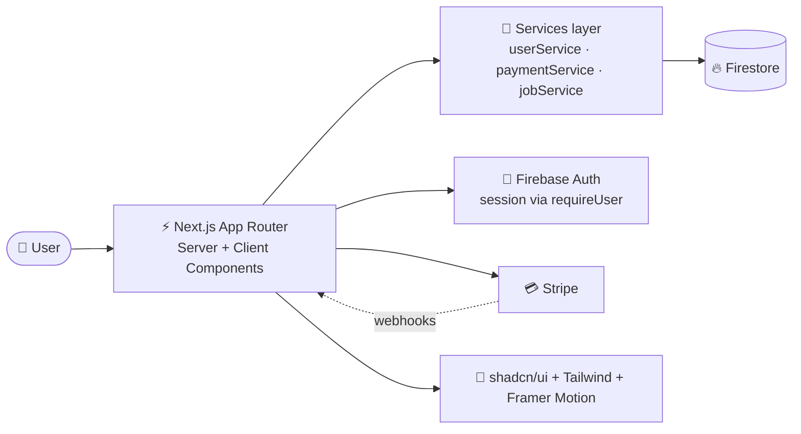

<div align="center">


<a href="https://git.io/typing-svg">
  
</a>

<br/>


**[✨ Features](#-features) · [🧰 Tech Stack](#-tech-stack) · [🏗️ Architecture](#%EF%B8%8F-architecture) · [📁 Folder Structure](#-folder-structure) · [🚀 Getting Started](#-getting-started) · [🤝 Contributing](#-contributing)**

</div>

---

## 📖 About

**Apni University** ek modern, full-stack online learning platform hai jahan students courses explore karte hain, instructors se seekhte hain, jobs dhoondte hain, aur apni learning journey ek hi jagah manage karte hain.

Platform ko performance, clean UI aur smooth animations ke saath banaya gaya hai, taake learning experience fast aur enjoyable ho.

> 🎯 **Mission:** Quality tech education ko har kisi ke liye accessible banana, aur learning ko seedha career se jodna.

---

## ✨ Features

<table>
<tr>
<td width="50%" valign="top">

### 🎓 For Students
- 📚 Course catalog with **categories, search & price filters** (free / paid)
- ⭐ Featured courses & popular categories
- 👨‍🏫 Instructor profiles
- 💬 Testimonials and course reviews
- 💳 **Payments dashboard**: history, status filters, CSV export, receipts
- 👤 **Profile** with avatar upload & profile-strength meter
- ⚙️ **Settings**: password change, email verification, notifications, theme, sign out everywhere

</td>
<td width="50%" valign="top">

### 🌐 Public Platform
- 🏠 Animated home page: hero, tech strip, categories, featured courses, jobs, instructors, testimonials, blog
- 💼 **Jobs board** with filters & cursor-based pagination
- 🧑‍💻 Careers page
- 💰 Pricing page
- 📝 Blog section
- 🌗 Light / Dark / System theme
- 📱 Fully responsive, mobile-first design

</td>
</tr>
<tr>
<td width="50%" valign="top">

### 🔐 Security
- Server-side session checks (`requireUser`) on protected pages
- Email verification flow
- Card details handled **only by Stripe**, never stored by us
- Server actions with input sanitisation

</td>
<td width="50%" valign="top">

### 🎨 UI / UX
- Smooth **Framer Motion** reveal & layout animations
- Accessible **shadcn/ui** components
- Consistent design tokens with Tailwind
- Reusable section, empty-state and header components

</td>
</tr>
</table>

---

## 🧰 Tech Stack

<div align="center">


</div>

| Layer | Technology | Kyun use kiya |
|---|---|---|
| **Framework** | [Next.js](https://nextjs.org/) (App Router) | Server Components, routing, SEO, server actions |
| **UI Library** | [React](https://react.dev/) | Component-based UI |
| **Styling** | [Tailwind CSS](https://tailwindcss.com/) | Fast, consistent utility-first styling |
| **Components** | [shadcn/ui](https://ui.shadcn.com/) | Accessible, customisable primitives |
| **Animation** | [Framer Motion](https://www.framer.com/motion/) | Scroll reveals, layout & progress animations |
| **Icons** | [React Icons](https://react-icons.github.io/react-icons/) | Large icon set in one package |
| **Database** | [Cloud Firestore](https://firebase.google.com/docs/firestore) | Realtime NoSQL data with composite indexes |
| **Auth** | [Firebase Authentication](https://firebase.google.com/docs/auth) | Email/password sign-in & verification |
| **Payments** | [Stripe](https://stripe.com/) | PCI-compliant checkout & receipts |
| **Hosting** | [Vercel](https://vercel.com/) / Firebase | Fast global deployment |

### 🧠 Technologies taught on the platform

<div align="center">


</div>

---

## 🏗️ Architecture



**Design principles**

1. **Pages are thin.** Server Components fetch data via the `services/` layer.
2. **Services own data access.** UI kabhi directly database se baat nahi karti.
3. **Client components sirf tab jab zaroorat ho** (filters, animations, forms).
4. **Content config se aata hai** (`config/content`), taake marketing text code se alag rahe.

---

## 📁 Folder Structure

> Yeh structure project ke imports aur conventions par based hai. Apni actual folders ke mutabiq adjust kar lein.

```text
apni-university/
├── app/                          # Next.js App Router
│   ├── (public)/                 # Home, courses, jobs, careers, pricing, blog
│   ├── student/                  # Protected student area
│   │   ├── payments/page.jsx     # Purchase history, stats, FAQ
│   │   ├── profile/page.jsx      # Profile hero, avatar, completion meter
│   │   └── settings/             # Security, notifications, appearance
│   │       ├── page.jsx
│   │       └── actions.js        # Server actions
│   ├── layout.jsx                # Root layout (providers, theme)
│   └── globals.css
│
├── components/
│   ├── ui/                       # shadcn/ui primitives (button, card, badge…)
│   ├── shared/                   # EmptyState, Section, SectionHeader, Stagger…
│   ├── student/                  # StudentPageHeader, PaymentHistory, ProfileForm…
│   └── home/                     # TechStrip, PopularCategories, FeaturedCourses,
│                                 # JobsSection, FeaturedInstructors, Testimonials, BlogSection
│
├── services/                     # Data-access layer
│   ├── userService.js
│   ├── paymentService.js
│   └── jobService.js
│
├── lib/
│   ├── auth/session.js           # requireUser() and session helpers
│   ├── firebase/                 # Client & admin SDK setup
│   └── utils.js                  # cn() and helpers
│
├── config/
│   └── content.js                # Site copy, techStrip data, navigation
│
├── public/                       # Images, icons, static assets
├── firestore.indexes.json        # Composite indexes (deployed with Firebase CLI)
├── firestore.rules               # Security rules
├── tailwind.config.js
├── next.config.js
├── .env.local                    # Local secrets (never commit)
└── package.json
```

---

## 🚀 Getting Started

### Prerequisites

- **Node.js** 18.17 or newer
- **npm** / pnpm / yarn
- A **Firebase** project (Auth + Firestore enabled)
- A **Stripe** account (test mode is fine)

### 1. Clone

```bash
git clone https://github.com/<your-username>/apni-university.git
cd apni-university
```

### 2. Install dependencies

```bash
npm install
```

### 3. Environment variables

`.env.local` banayein:

```env
# Firebase (client)
NEXT_PUBLIC_FIREBASE_API_KEY=
NEXT_PUBLIC_FIREBASE_AUTH_DOMAIN=
NEXT_PUBLIC_FIREBASE_PROJECT_ID=
NEXT_PUBLIC_FIREBASE_STORAGE_BUCKET=
NEXT_PUBLIC_FIREBASE_MESSAGING_SENDER_ID=
NEXT_PUBLIC_FIREBASE_APP_ID=

# Firebase Admin (server)
FIREBASE_PROJECT_ID=
FIREBASE_CLIENT_EMAIL=
FIREBASE_PRIVATE_KEY=

# Stripe
STRIPE_SECRET_KEY=
STRIPE_WEBHOOK_SECRET=
NEXT_PUBLIC_STRIPE_PUBLISHABLE_KEY=

# App
NEXT_PUBLIC_SITE_URL=http://localhost:3000
```

> ⚠️ Variable names aapke code ke hisaab se different ho sakte hain. `.env.local` ko kabhi Git mein commit na karein.

### 4. Firestore indexes deploy karein

Jobs aur courses ke filtered queries ke liye composite indexes zaroori hain:

```bash
npm install -g firebase-tools
firebase login
firebase deploy --only firestore:indexes
```

### 5. Development server

```bash
npm run dev
```

Browser mein [http://localhost:3000](http://localhost:3000) kholein 🎉

### Stripe webhooks (local testing)

```bash
stripe listen --forward-to localhost:3000/api/webhooks/stripe
```

---

## 📜 Scripts

| Command | Description |
|---|---|
| `npm run dev` | Development server |
| `npm run build` | Production build |
| `npm run start` | Production server chalayein |
| `npm run lint` | ESLint check |

---

## 🗺️ Roadmap

- [x] Public pages: home, courses, jobs, careers, pricing
- [x] Student dashboard: payments, profile, settings
- [x] Stripe payment history & receipts
- [ ] Course progress tracking & certificates
- [ ] Instructor dashboard
- [ ] Discussion / Q&A per course
- [ ] Multi-language support (Urdu / English)
- [ ] Mobile app (React Native)

---

## 🤝 Contributing

Contributions ka welcome hai!

1. Repo ko **Fork** karein
2. Branch banayein: `git checkout -b feature/amazing-feature`
3. Changes commit karein: `git commit -m "feat: add amazing feature"`
4. Push karein: `git push origin feature/amazing-feature`
5. **Pull Request** open karein

**Code style:** components chhote aur reusable rakhein, data access `services/` mein, aur UI text `config/content` mein.

---

## 🔒 Security

Agar aapko koi vulnerability mile to please public issue na kholein. Seedha maintainers ko email karein.

---

## 📄 License

Yeh project **MIT License** ke tahat hai. Details ke liye `LICENSE` file dekhein.

---

<div align="center">

### 💙 Made with passion for learners everywhere

⭐ **Agar project pasand aaye to repo ko star zaroor karein!** ⭐


</div>